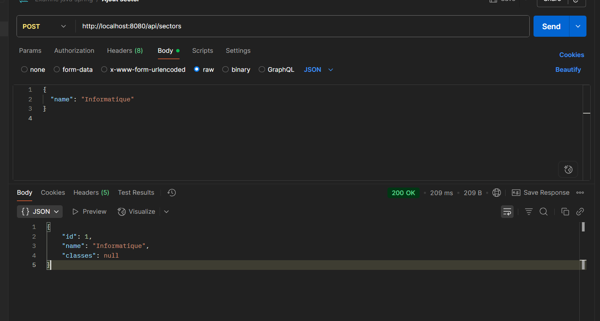
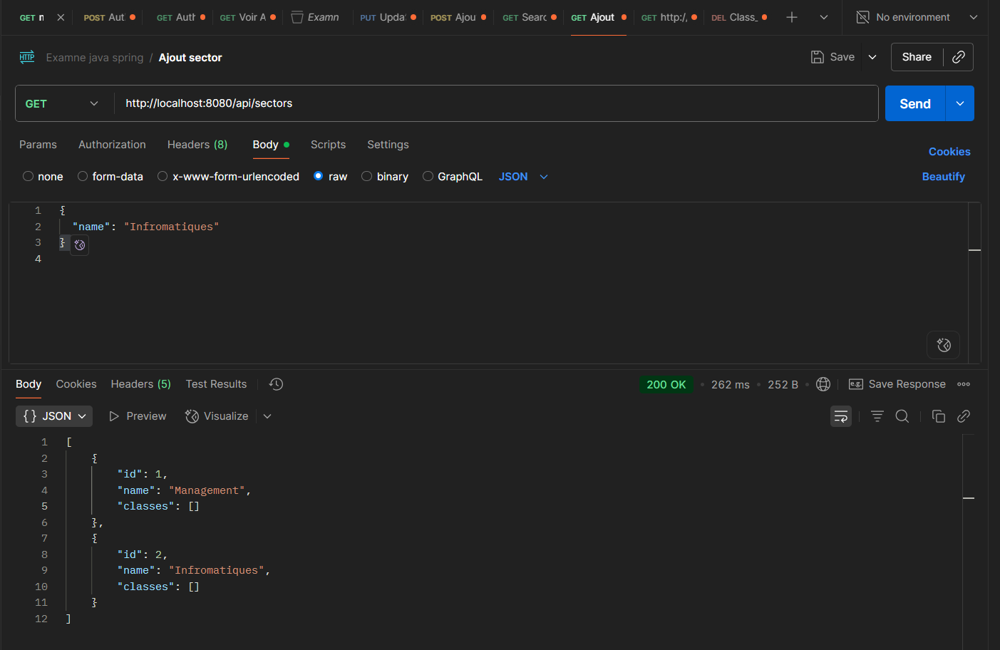
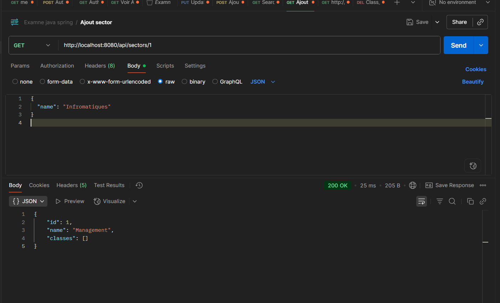
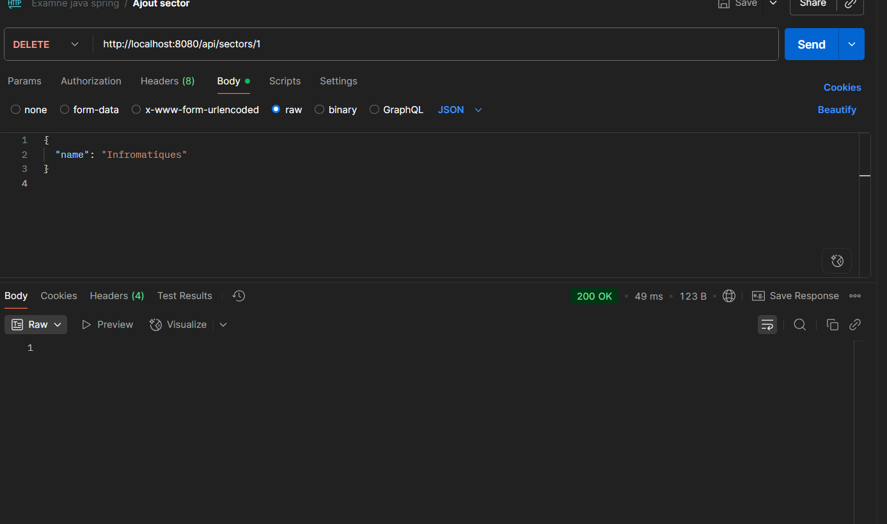
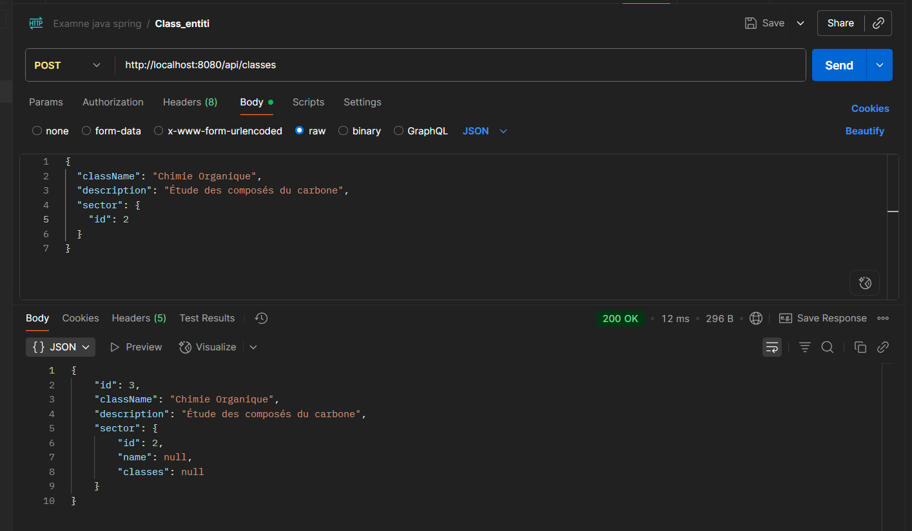
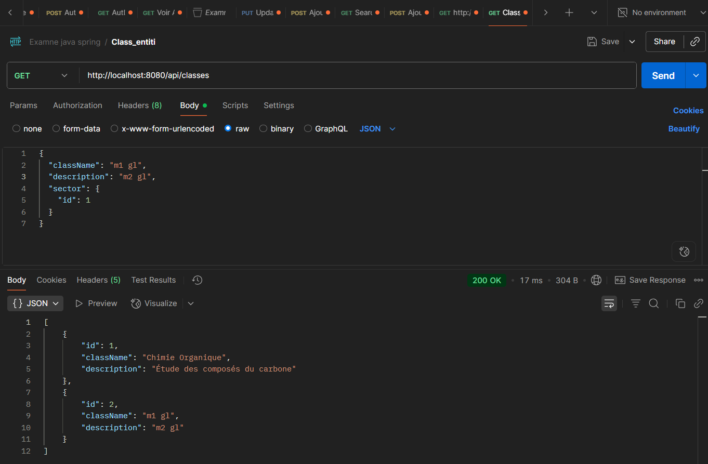
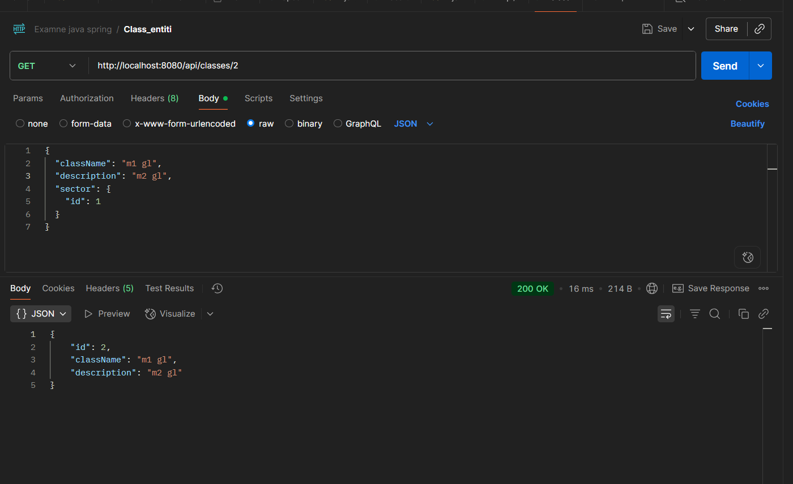
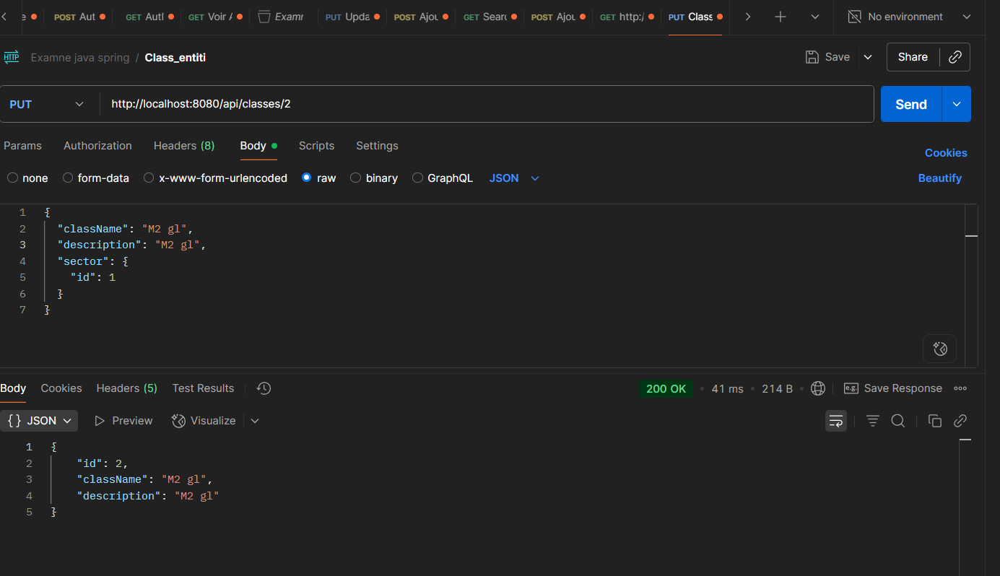
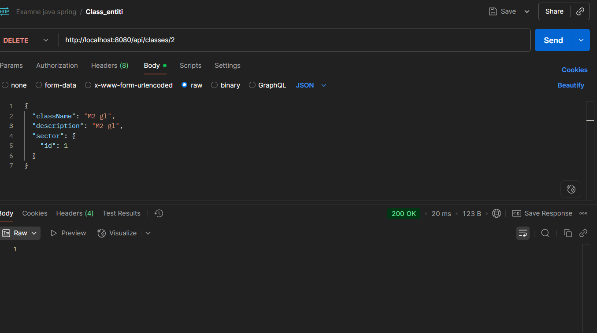

# 📚 Projet Spring Boot - CRUD Sector & ClassEntity

Ce projet est une application **Spring Boot** permettant de gérer les entités **`Sector`** et **`ClassEntity`** via des opérations CRUD, avec une relation **One-to-Many** (1 secteur ➝ plusieurs classes).

---

## ✅ Prérequis

- Java **21**
- Maven **3.6** ou plus
- MySQL (version compatible avec Hibernate)
- Postman (pour tester l’API REST)
- Git

---

## ⚙️ Installation & Configuration


```bash
1. Cloner le dépôt

git clone https://github.com/glenn2016/Exmen_java.git
cd Exmen_java

2. Créer la base de données MySQL
Connecte-toi à ton interface MySQL (ex : phpMyAdmin) et exécute :

CREATE DATABASE examen_jee;

3. Configurer la connexion à la base de données
Modifie le fichier src/main/resources/application.properties avec tes identifiants MySQL :

# Configuration de la base de données
spring.datasource.url=jdbc:mysql://localhost:3306/examen_jee?useSSL=false&serverTimezone=UTC
spring.datasource.username=TON_UTILISATEUR
spring.datasource.password=TON_MOT_DE_PASSE
spring.datasource.driver-class-name=com.mysql.cj.jdbc.Driver

# Configuration JPA / Hibernate
spring.jpa.hibernate.ddl-auto=update
spring.jpa.show-sql=true
spring.jpa.properties.hibernate.dialect=org.hibernate.dialect.MySQL8Dialect


🚀 Lancer l'application
mvn spring-boot:run
```
TEst 


















